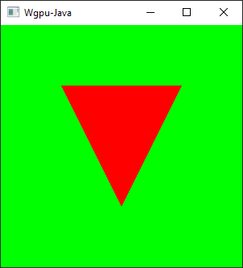

# Wgpu-Java


Java bindings for [Wgpu](https://github.com/gfx-rs/wgpu) based on
[Wgpu-native](https://github.com/gfx-rs/wgpu-native). 

##### Requirements:
- Rust 
- Java JDK 11+



### Structure :
###### wgpu-java/core
Libraries that make wgpu easier to use in Java.
Includes a windowing library, rendering pipelines, swap chains, etc. Uses 
LWJGL to get Glfw bindings 

###### wgpu-java/native: 
Actual bindings with wgpu-native. Bindings are created at 
runtime using [jnr-ffi](https://github.com/jnr/jnr-ffi)

###### wgpu-java/native/wgpu-native
The [fork](https://github.com/DevOrc/wgpu-native/tree/jnr-compatible) of wgpu-native that this library uses.
A fork is needed to add some functionsto get around some problems with jnr-ffi 
(the library that produces the bindings from java to rust)

###### wgpu-java/native/wgpu-test
A cargo crate that has functions used for unit testing the FFI code.

###### wgpu-java/examples
Examples based on the wgpu-native examples on how to use wgpu-java/core

### How to run:
Gradle will automatically build the required dll/.so/.dylib when wgpu-java/natives 
is compiled, so you only need to run the following command:
```
git clone https://github.com/DevOrc/wgpu-java
gradlew triangleExample
gradlew computeExample
```

### Supported Platforms
   API   |    Windows 7/10    |  Linux                 |    macOS               |
  -----  | ------------------ | ------------------     | ------------------     |
  DX11   | :white_check_mark: |                        |                        |
  DX12   | :white_check_mark: |                        |                        |
  Vulkan | :white_check_mark: | :large_orange_diamond: |                        |
  Metal  |                    |                        | :large_orange_diamond: |
  OpenGL | :construction:     | :construction:         | :construction:         |
  
:white_check_mark: = Supported

:large_orange_diamond: = Supported by Wgpu but *__not__* by Wgpu-java (yet)

:construction: = Wgpu support being worked on

### Contributing
I only have a windows machine, so the best way to contribute is to write
and test the platform specific code (i.e. window handling). For more details, file a github issue about your 
platform.