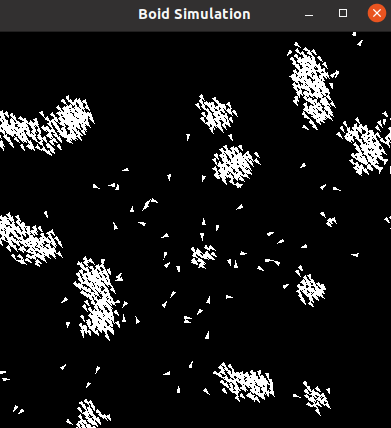
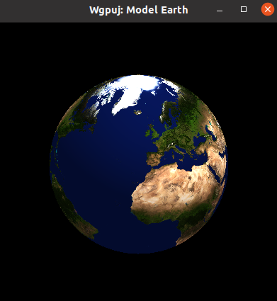

# Wgpu-Java


# NOTE: THIS IS THE ARCHIVED VERSION
# NEW VERSION: [kgpu/kgpu](https://github.com/kgpu/kgpu) 

Java bindings for [Wgpu](https://github.com/gfx-rs/wgpu) based on
[Wgpu-native](https://github.com/gfx-rs/wgpu-native). 

##### Requirements:
- Rust 
- Java JDK 11+





### Documentation

Documentation/Book: 
[Link](https://devorc.github.io/wgpu-java/)

Javadocs:
 [Link](https://devorc.github.io/wgpu-java/javadoc/index.html) 

### How to run:
Gradle will automatically build the required dll/.so/.dylib when wgpu-java/natives 
is compiled. To run the default example, execute the following command: 
```bash
git clone https://github.com/DevOrc/wgpu-java
gradlew runExample
```

To run a specific example:
```bash
gradlew runExample -Pexample={EXAMPLE_NAME_HERE}
gradlew runExample -Pexample=TriangleExample
gradlew runExample -Pexample=ComputeExample
```

 Example Name | Command |
 -------------|---------|
 Triangle | gradlew runExample -Pexample=TriangleExample |
 Compute | gradlew runExample -Pexample=ComputeExample |
 Cube | gradlew runExample -Pexample=CubeExample |
 Vertex | gradlew runExample -Pexample=VertexExample |
 Hex World | gradlew runExample -Pexample=HexWorldExample |
 Window Events | gradlew runExample -Pexample=WindowEventExample |
 Boid Simulation | gradlew runExample -Pexample=BoidExample |

### Supported Platforms
__Windows 7/10__: Vulkan, DX12, DX11

__MacOS__: Metal (See [Issue #4](https://github.com/DevOrc/wgpu-java/issues/4))

__Linux__:  Vulkan 
 
### Contributing
I only have a windows/linux machine, so the best way to contribute is to write
and test the platform specific code (i.e. window handling for rendering pipelines). For more details, see 
[issue #4](https://github.com/DevOrc/wgpu-java/issues/4)
